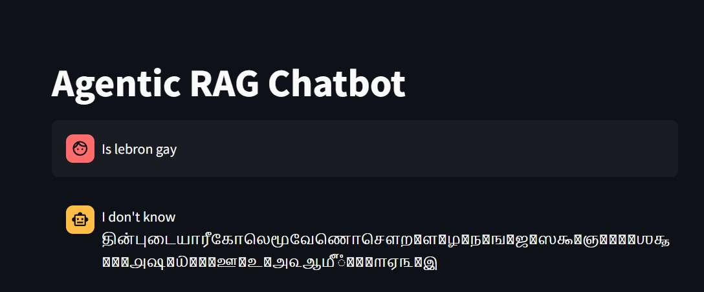
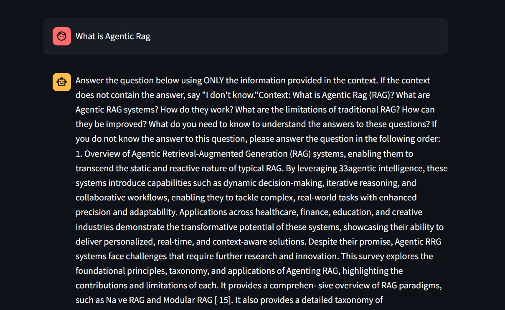

# Agentic RAG Chatbot

This project implements a Retrieval-Augmented Generation (RAG) chatbot that answers questions using a single research paper as its knowledge base. The goal is to create a system that does not hallucinate or rely on external knowledge, but instead responds only using information retrieved from the provided document.

## Project Overview

The chatbot operates in three main stages:

1. **Ingestion**  
   The provided PDF paper (`Agentic RAG`) is parsed using `PyPDF2`,which has caused a lot of issues as it creates noisy characters and random junk text but I have tried to remove noisy characters and citation markers, then chunked into manageable pieces. Each chunk is embedded using `all-MiniLM-L6-v2` from `sentence-transformers`, and stored in a ChromaDB vector database.

2. **Retrieval**  
   When a user enters a query, it is embedded and matched against the stored chunks using semantic similarity. The top relevant chunks are retrieved.

3. **Generation**  
   The retrieved context, along with the user's query, is passed to a text-to-text generation model (`facebook/bart-large`) via HuggingFace Transformers. The prompt explicitly instructs the model to respond using only the provided context and fallback to "I don't know" when appropriate.

## Architecture

- PDF Parsing and Cleaning: `PyPDF2` and `re`
- Embeddings: `sentence-transformers` (`all-MiniLM-L6-v2`)
- Vector Database: `ChromaDB`
- Text Generation: `facebook/bart-large` with HuggingFace Pipelines
- Frontend: `Streamlit`

## Example 1: Irrelevant Question

If the user asks a question unrelated to the Agentic RAG paper (e.g., "Is LeBron gay?"), the chatbot correctly identifies that the context does not contain relevant information and returns a fallback response. Please ignore the junk text that came with the expected output.

**Expected Output:**

**Screenshot:**

## Example 2: Research-Related Question

For a question directly related to the content of the Agentic RAG paper (e.g., about agentic workflows, transformer backbones, or planning in LLMs), the chatbot responds accurately using context from the document.

**Screenshot:**

## Limitations

- The chatbot answers only based on the single ingested document.
- PDF formatting inconsistencies may still introduce noise in some chunks.
- Retrieval is based on chunk-level semantic similarity without deeper passage ranking.